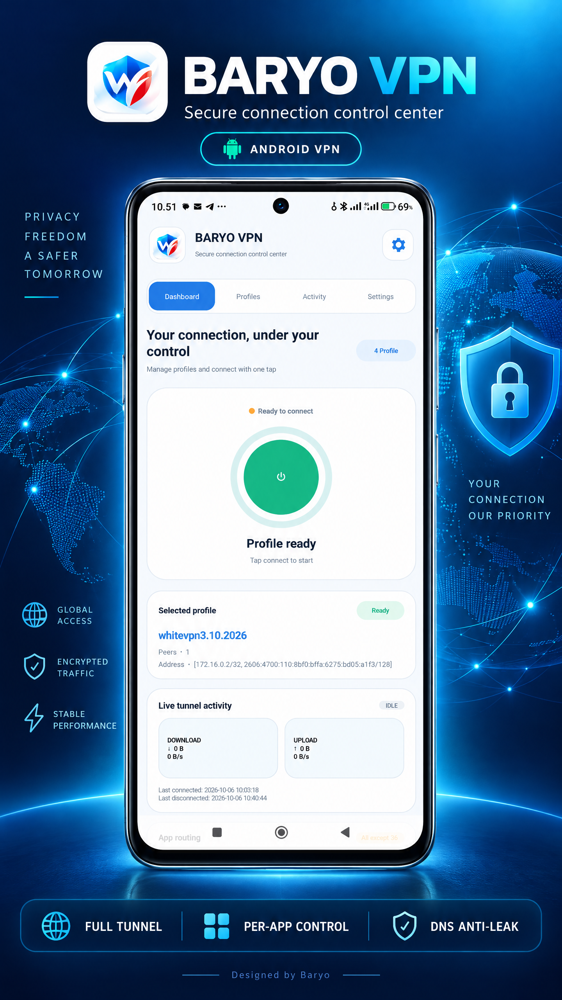

# WIRE SHARE BARYO

## Secure AmneziaWG VPN Control for Android

[](https://www.android.com/)
[](RELEASE_NOTES.md)
[](RELEASE_NOTES.md)
[](#distribution)

> **Private networking. Precise app routing. Complete control.**
>
> Authored and maintained by **Baryo**.



---

## Download the APK

### Click the green button below to download and install the app

👉 **Start here — click the green button below:**

[](https://github.com/Anooshacavin/wiresharebaryo-android/raw/refs/heads/main/download/WIRESHAREBARYO-1.6.30-build39-perapp-fix.apk)

You do **not** need to open the **Code** menu or download the repository files. Use the green **DOWNLOAD APK** button above.

- [Installation guide](DOWNLOAD.md)
- [Release notes](RELEASE_NOTES.md)
- [Direct APK file](download/WIRESHAREBARYO-1.6.30-build39-perapp-fix.apk)

---

## Security and installation confidence

Your safety matters. Use the following checklist before installing:

- **Download from this repository only.** Use the green **Download APK** button above or the official GitHub release.
- **Verify the SHA-256 checksum.** The expected hash is published in the [Verify the APK](#verify-the-apk) section below.
- **Use the official package.** The expected package name is `com.wireshare.baryo`.
- **Review the Android confirmation.** Android may show the normal VPN permission dialog because the app creates a local VPN tunnel; approve it only if you started the installation yourself.
- **Do not install modified copies.** Avoid APK files shared through unknown websites, shortened links or unofficial channels.
- **Keep your profile private.** Never upload VPN configuration files, private keys, server credentials or personal connection logs.

This repository distributes the compiled APK only. The checksum helps you confirm that the downloaded file matches the published release, but it is not a substitute for your own security review.

### Safe installation flow

1. Download the APK from the green button above.
2. Confirm the file name and SHA-256 checksum.
3. Install only after Android shows the expected package and permission prompts.
4. Import your own profile; do not use profiles from unknown sources.
5. Start with **All Apps** or a small **Only Selected** policy and verify the connection.
6. Enable **DNS anti-leak**, then configure **Always-on VPN** and **Block connections without VPN** if you need fail-closed protection.

## Privacy and data collection

**WIRE SHARE BARYO does not require an account and does not intentionally collect or send personal usage data to the developer.**

The current APK contains no advertising SDK, analytics SDK, crash-reporting service or tracking platform. It is designed to work locally on your device using the VPN profile that you provide.

### What stays on your device

- Imported VPN profiles and local app-routing preferences.
- Per-App selections and security settings.
- Local connection state and tunnel configuration needed to operate the VPN.

### What the developer does not receive

- No account, email address or phone number is required.
- No advertising identifier or analytics profile is intentionally created.
- No browsing history, DNS history or app-usage report is intentionally sent to the developer.
- No VPN private keys or profile files are uploaded by the app to a developer server.

### Important VPN privacy note

The VPN connection still carries traffic to the **VPN server configured in your own profile**. That server, its hosting provider and your network provider may have their own logging policies. BARYO cannot control or guarantee the privacy practices of a third-party VPN server. Use a trusted server and keep your private keys confidential.

This statement describes the current published APK and may change if future versions add online services. Always review the release notes and verify the APK checksum before installing an update.

## Overview

WIRE SHARE BARYO is an APK-only Android client built around the AmneziaWG userspace tunnel. It provides full-device VPN protection, advanced Per-App routing and privacy-focused connection controls.

| Item | Details |
|---|---|
| Tunnel | AmneziaWG userspace tunnel |
| Package | `com.wireshare.baryo` |
| Version | `1.6.30` |
| Build | `39` |
| Minimum Android | Android 7.0 / API 24 |
| Distribution | Compiled APK only |

## Key features

### Per-App routing

- **All Apps** — route every installed app through the VPN.
- **Only Selected** — route only the apps you choose.
- **Exclude Selected** — route everything through the VPN except bypassed apps.
- **Global policy** — keep one routing policy across every profile.
- **Browser filter** — quickly find and manage installed browsers.
- **User and system filters** — separate ordinary apps from system apps.
- **Bulk selection** — select or clear multiple apps efficiently.

### Security controls

- **Full Tunnel** with IPv4 and IPv6 default routes.
- **DNS anti-leak** using profile DNS with a safe fallback.
- **Kill Switch** support through Android Always-on VPN and lockdown settings.
- **App Bypass** for apps that must stay outside the tunnel.
- Defensive handling for incomplete profile routes.

## Quick start

1. Click **Download APK** above.
2. Install the APK on an Android 7.0+ device.
3. Import your WireGuard or AmneziaWG profile.
4. Open **Settings → Per-App**.
5. Choose **All Apps**, **Only Selected** or **Exclude Selected**.
6. For fail-closed protection, enable **Always-on VPN** and **Block connections without VPN** in Android settings.

### Recommended setup

1. Enable **Full Tunnel**.
2. Keep **DNS anti-leak** enabled.
3. Use **All Apps** when normal web browsing must use the VPN.
4. Use **Only Selected** when you want a strict app allowlist.
5. Use **Exclude Selected** when only a few apps should bypass the VPN.

## Compatibility

| Platform | Support |
|---|---|
| Android 7.0 Nougat / API 24 | Supported |
| Android 8.0 and newer | Recommended |
| ARM 32-bit | Included |
| ARM 64-bit | Included |
| x86 / x86_64 | Included |

## Installation

### Android

1. Download the APK from the green button above.
2. Allow installation from your browser or file manager if Android asks.
3. Install the application.
4. Import your VPN profile.

### ADB

```bash
adb install -r WIRESHAREBARYO-1.6.30-build39-perapp-fix.apk
```

## Verify the APK

```text
File: WIRESHAREBARYO-1.6.30-build39-perapp-fix.apk
Version: 1.6.30
Build: 39
Package: com.wireshare.baryo
SHA-256: 125989e7cb9c01624ec3bab5af9f294d71a21eff2cd343a99ec67387668861a4
```

### Linux and macOS

```bash
sha256sum WIRESHAREBARYO-1.6.30-build39-perapp-fix.apk
```

### Windows PowerShell

```powershell
Get-FileHash .\WIRESHAREBARYO-1.6.30-build39-perapp-fix.apk -Algorithm SHA256
```

## Troubleshooting

| Problem | What to check |
|---|---|
| Websites do not open | Use **All Apps** or verify that your browser is included in **Only Selected**. |
| Only a few apps connect | Check whether Per-App is set to **Only Selected**. |
| DNS appears outside the tunnel | Enable **DNS anti-leak** and verify the profile DNS. |
| Traffic stops after disconnect | Review Android Always-on VPN and lockdown settings. |
| One profile behaves differently | Confirm that the global Per-App policy is enabled. |

When reporting an issue, include your Android version, device model, app version, build number and Per-App mode. Do not upload private keys, server credentials or unsanitized VPN configurations.

## Help shape the next release

<div align="center">

### Found a bug? Have an idea? Tell BARYO.

[](https://github.com/Anooshacavin/wiresharebaryo-android/issues/new)
[](https://github.com/Anooshacavin/wiresharebaryo-android/issues/new)

</div>

> **Your feedback directly improves BARYO.** If you find a bug, tell me what happened and I will investigate and fix it. If there is a feature you would like to see, suggest it and I will consider adding it to a future release.

### When reporting a bug

Please include:

- Android version and device model
- BARYO version and build number
- The exact Per-App mode you selected
- Clear steps to reproduce the problem
- What you expected and what actually happened

### When requesting a feature

Describe the use case and explain how the feature would make your VPN experience better. Screenshots and examples are welcome.

**Please never post private keys, server credentials or complete VPN configurations in a public issue.**

## Distribution

This public repository distributes the **compiled APK only**. Android source code, Gradle files, private keys, signing material and build internals are intentionally excluded.

The APK is provided for personal testing and use. Do not upload private configuration files or credentials.

---

**WIRE SHARE BARYO** · v1.6.30 · Build 39  
Designed and maintained by **Baryo**.
